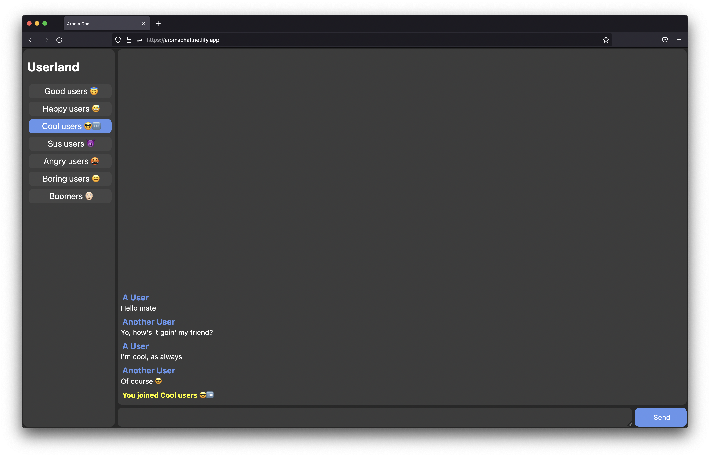

# About us
Aroma is an Open Source instant messaging service designed at [IIS A. Avogadro](https://www.sito.itisavogadro.org) by a group of students. It revolves around the Aroma Protocol, a set of rules that dictate how an Aroma Server and a Client communicate.

## Our commitment to opnness and modularity
We provide Reference Implementations for all our products in the form of clients, servers and libraries, but we also plan on providing documentation about the underlying protocols, design patterns and APIs to allow third-party developers to create custom experiences.  

We are also commited to publishing all our source code on this GitHub Organization under Free or Open Source licenses to provide developers with in-depth knowledge of our platofrms and allow them to improve, extend and audit our code in a cooperative and inclusive manner.
